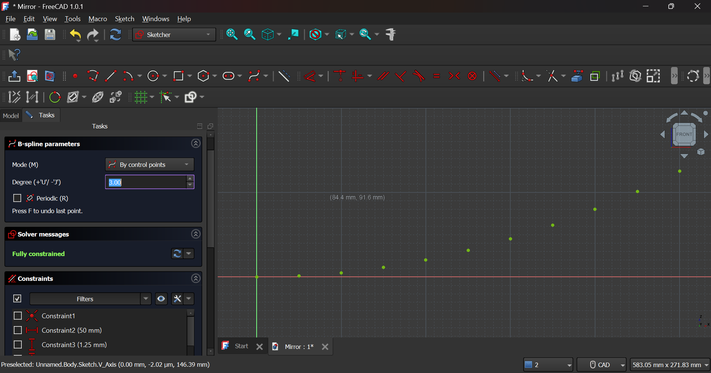
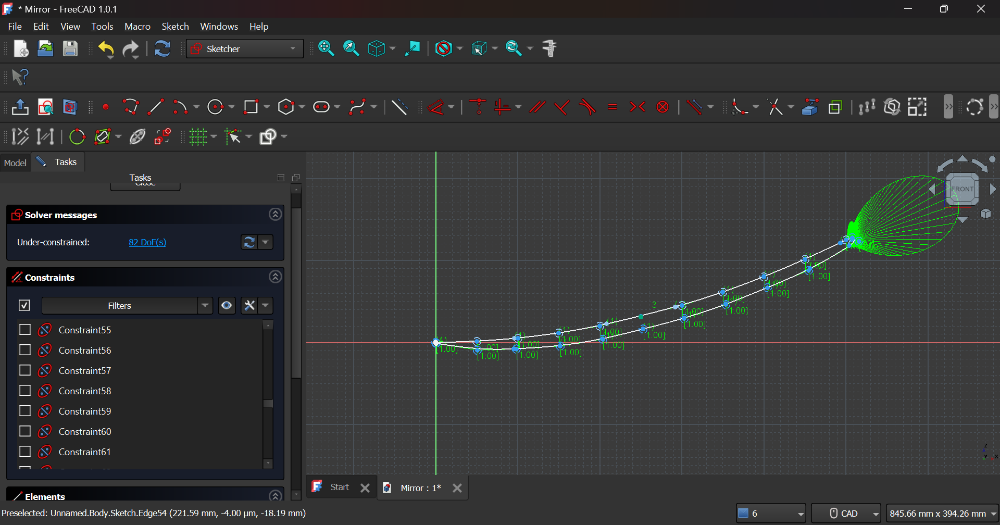

# 🌞 Solar-Powered Steam Generator for Rural Electricity

This open-source project explores how to generate electricity in rural or off-grid areas using a **solar-powered steam generator**. The system focuses sunlight with a **parabolic reflector** to heat water into pressurized steam, which can drive a small turbine or generator.

## ✨ Project Overview

Originally, I designed the solar concentrator in FreeCAD, but the first version had a filled center due to incorrect sketch geometry. To improve accuracy, I redesigned the parabola from scratch using the equation `y = 0.005x²`, with a focal length of `0.5 m`.

- **B-spline sketching** was used for smoother control of the curve.
- All constraints were carefully applied to fix under-constrained geometry.
- The new revolve operation now generates a **hollow parabolic dish**, ideal for focusing sunlight into a small receiver area.
- This update improves both the **visual realism** and **functional efficiency** for steam generation.

## 📁 Files Included

- `parabolic_dish.FCStd` — FreeCAD model of the concentrator dish
- (Coming soon) Thermal simulation files, receiver designs, physical testing data

## 🔍 Design Highlights

- Parabolic curve based on the equation:
  ```
  z = x² / (4f),   with  f = 0.5 m
  ```
- Created using **B-spline sketching**, revolved around central axis in FreeCAD
- Geometry fixes included resolving:
  - Open wire profile errors
  - Axis intersection during revolution
  - Sketch translation issues inside FreeCAD’s Sketcher

## 📐 Parabolic Dish Profile Points

Below are the key points for plotting the parabolic dish profile in FreeCAD, with all measurements in millimeters (mm).  
These coordinates are intended for use in the Sketcher workbench on the XZ_Plane (`x` → X-axis, `z` → Z-axis).

| X (mm) | Z (mm) |
| :----- | :----- |
| 0      | 0      |
| 50     | 1.25   |
| 100    | 5.0    |
| 150    | 11.25  |
| 200    | 20.0   |
| 250    | 31.25  |
| 300    | 45.0   |
| 350    | 61.25  |
| 400    | 80.0   |
| 450    | 101.25 |
| 500    | 125.0  |

**How to use these points:**
- **(0, 0):** The vertex (deepest point) at the center of the dish.
- **(500, 125.0):** The rim of the dish, 500 mm (50 cm) from the center, with a depth of 125 mm (12.5 cm).
- Plot these (X, Z) pairs in FreeCAD’s Sketcher using the B-spline tool to define the parabolic curve.

*These points correspond to a dish with a 100 cm diameter and 12.5 cm depth. The grid units in FreeCAD (10 mm = 1 cm) match these values directly.*

## 🚀 Next Steps

- Model the **receiver coil** to be placed at the focus point
- Build a **pressure system** for safe steam generation
- Explore **turbine integration** for electricity production

## 🎯 Why This Project?

Rural electrification remains a challenge in many parts of the world. This project aims to demonstrate a **clean, small-scale energy system** that can be:
- Built with **affordable materials**
- Powered entirely by the **sun**
- Repaired or scaled locally

## 🔧 Tools & Technologies

- `FreeCAD` (3D modeling)
- `ESP32` (for future automation)
- `Python / Arduino` (planned control system)
- `Blender / Fusion` (optional renders)
- Basic thermal physics, solar tracking (planned)

## 📸 Preview


*A screenshot of the graph for plotting the curve of the parabola.*


*A screenshot of the plotting the points of the parabola.*


*A screenshot of the bspline on the points of the parabola.*

  
*A render of the completed 3D parabolic reflector model.*

  
*A render of the completed 3D parabolic reflector model.*


## 📌 Roadmap

- [x] Design and model parabolic reflector
- [X] (Fixing potential issues and reiterating)
- [ ] Proper rendering and simulation and data retrival
- [ ] Build physical prototype using reflective surface
- [ ] Boil water and measure steam output
- [ ] Develop pressure control + safety system
- [ ] Add small-scale turbine or generator

## 🤝 Contributions & Feedback

This project is in its early phase — if you're working on similar renewable energy solutions or want to collaborate, feel free to open an issue or connect with me on [LinkedIn](www.linkedin.com/in/husainlokii).

## 📜 License

This project is open-sourced under the **MIT License**.

---

